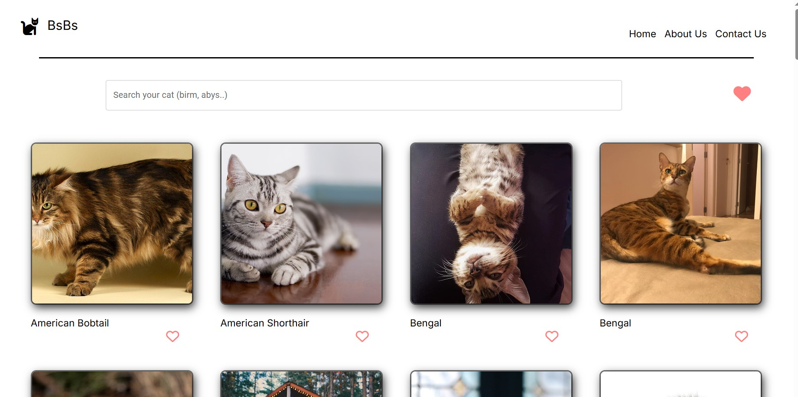
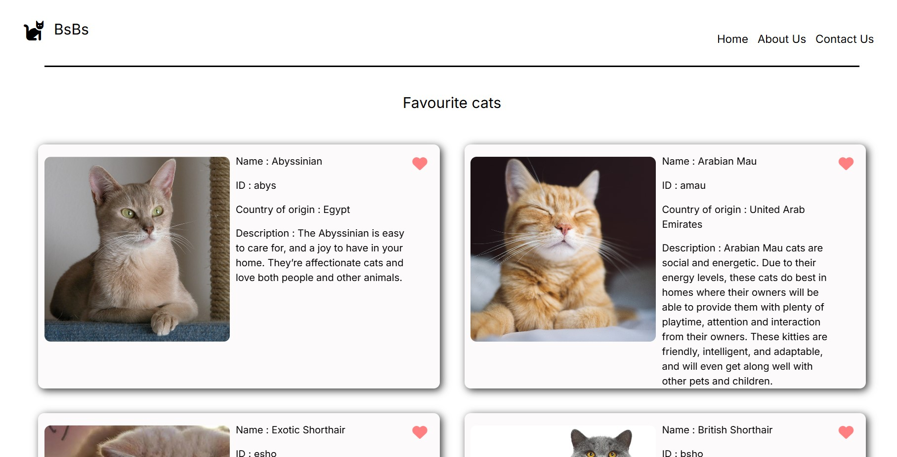

## Because of my love for cats I thought to create my first website about cats.

## Implemetation:
I implemented BsBs first using React then applied the same design just using Next.JS framework.  
How it works is that I fetch my cats from the catapi then display them with their name. We can search for cats as well as adding them to your favorites, which if you go to your favourites tab would see additional inforamtion about each cat you added.

